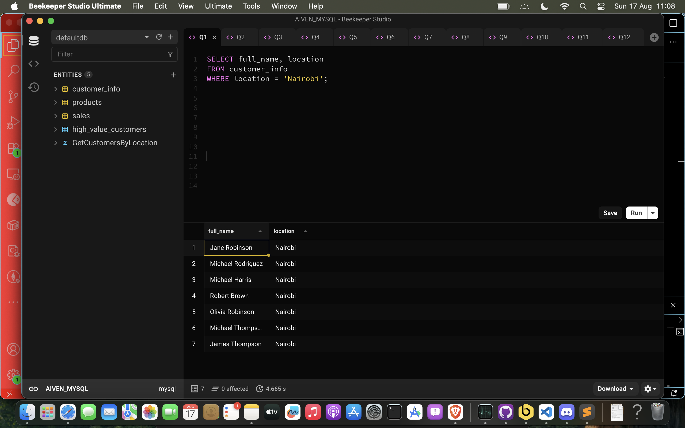
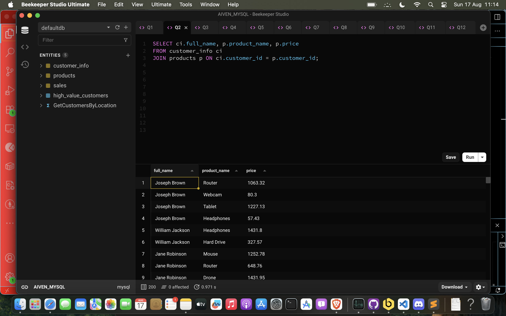
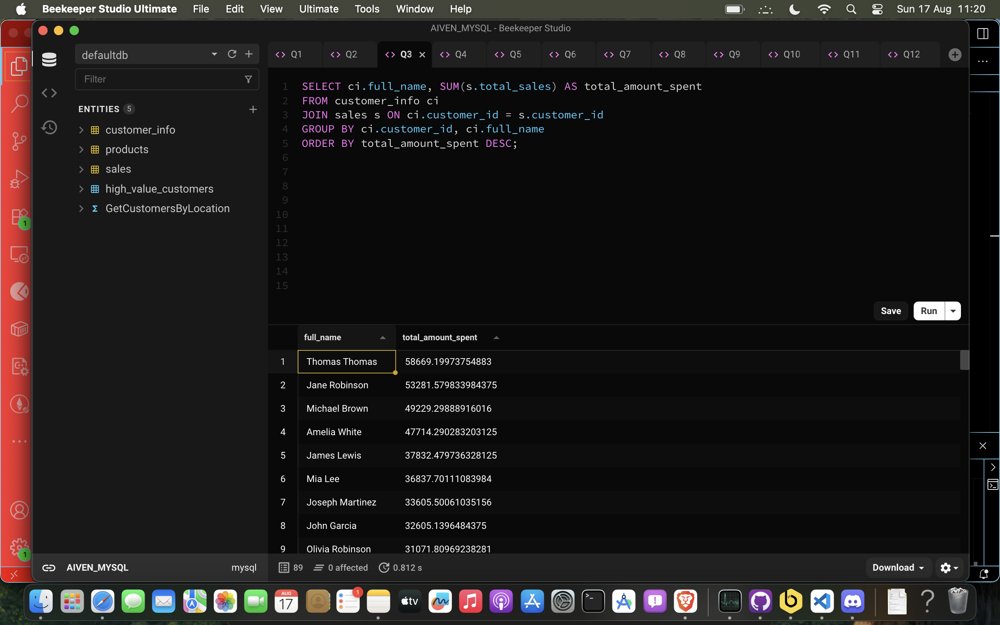
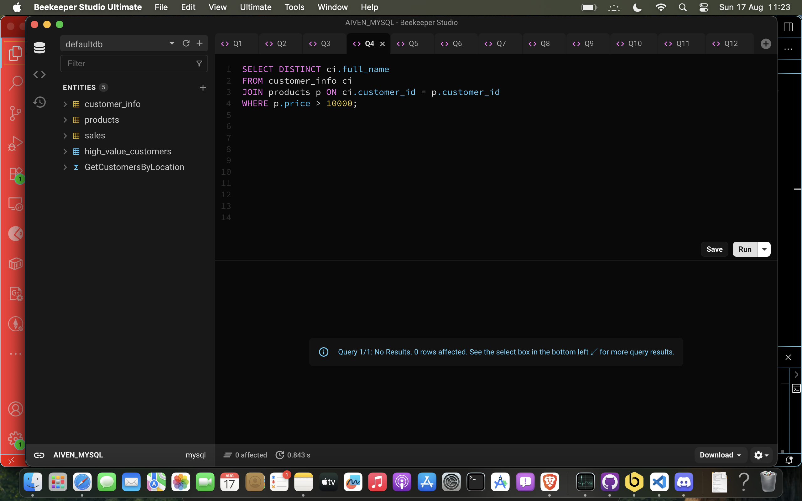
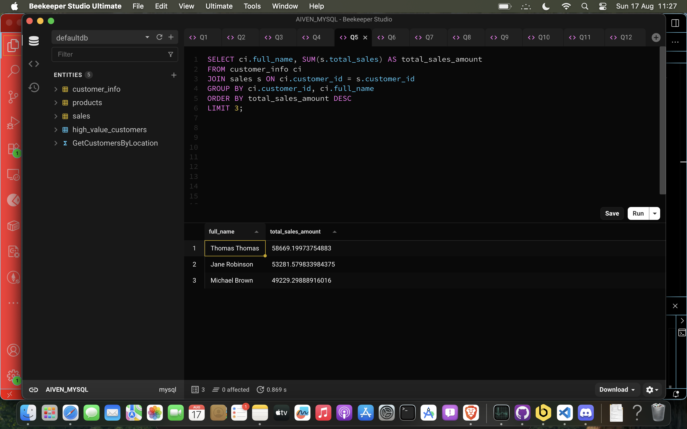
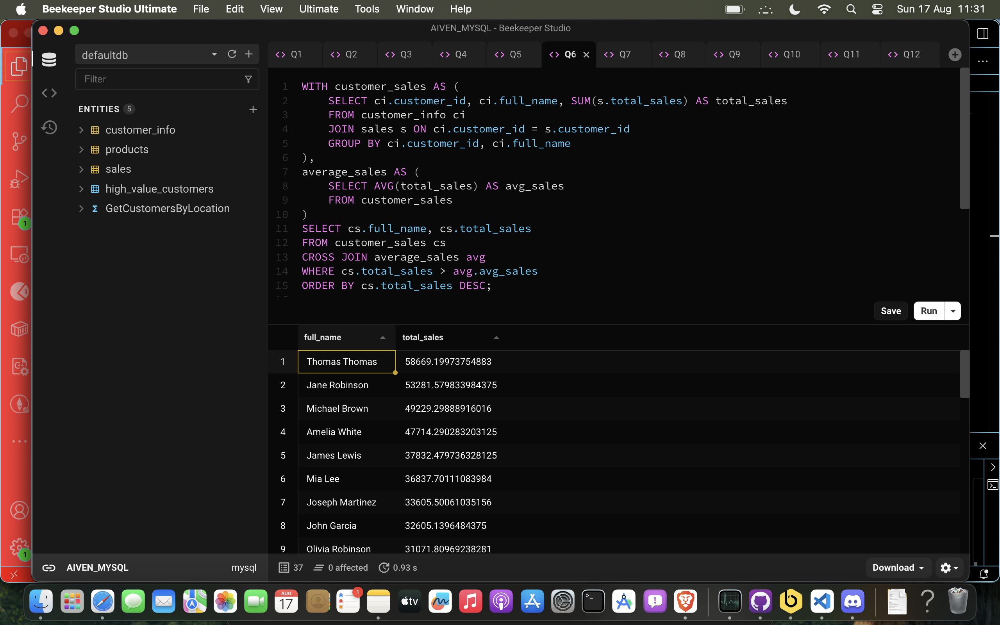
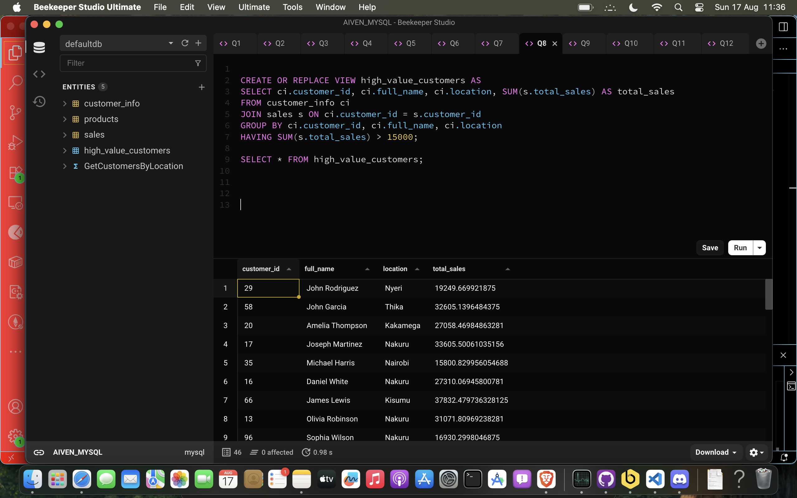
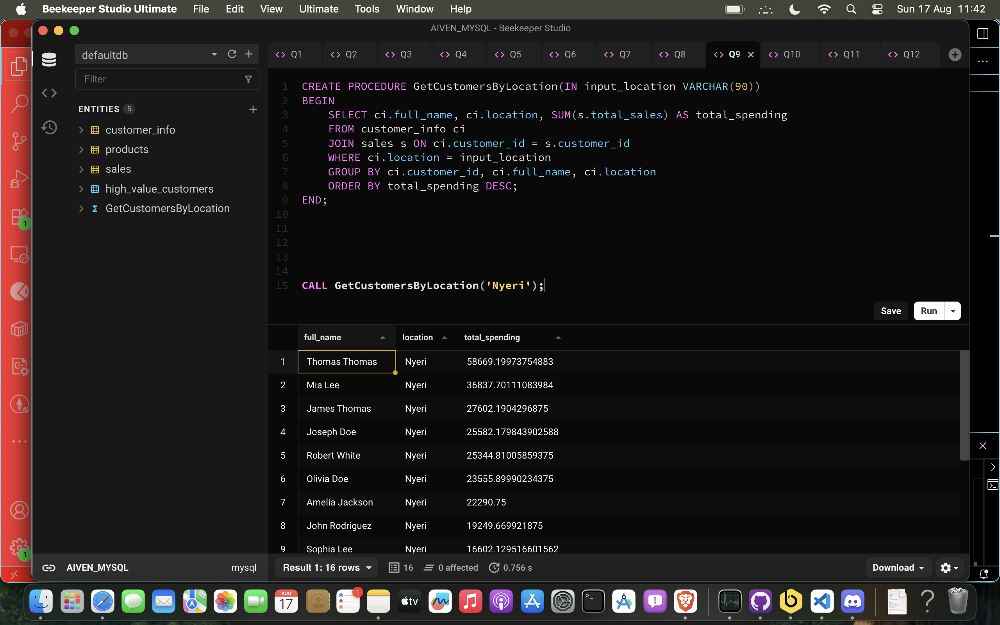
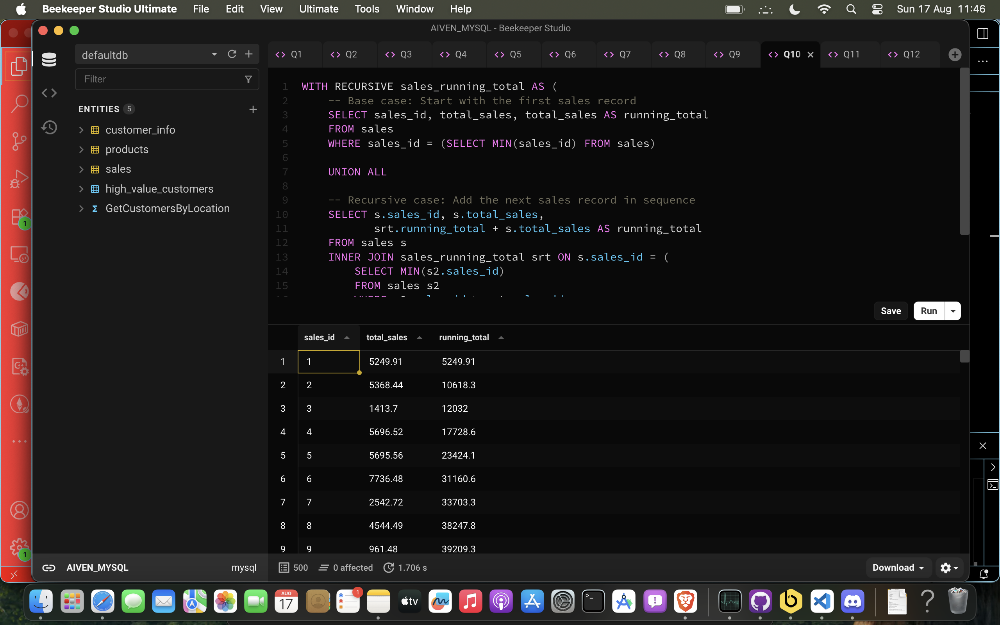
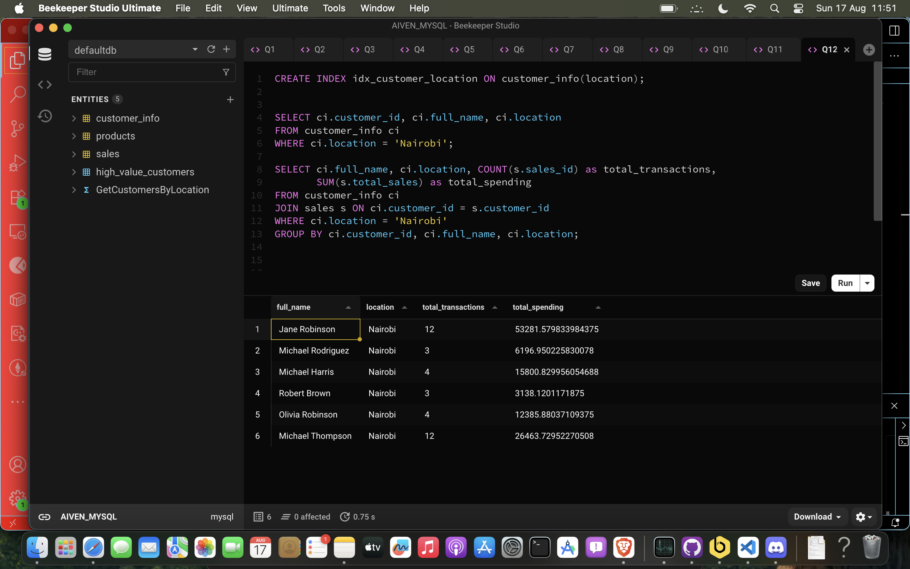

# SQL Essentials for Data Engineering

This project demostrates my ability to work with SQL in
real-world data engineering scenarios by creating queries, stored procedures, design data models, and optimizing SQL for performance.

## Database Schema

The original database consists of three main tables:

```sql
CREATE TABLE customer_info(
    customer_id INT PRIMARY KEY,
    full_name VARCHAR(120),
    location VARCHAR(90)
);

CREATE TABLE products(
    product_id INT PRIMARY KEY,
    product_name VARCHAR(120),
    price FLOAT,
    customer_id INT,
    FOREIGN KEY (customer_id) REFERENCES customer_info(customer_id)
);

CREATE TABLE sales(
    sales_id INT PRIMARY KEY,
    total_sales FLOAT,
    product_id INT,
    customer_id INT,
    FOREIGN KEY (product_id) REFERENCES products(product_id),
    FOREIGN KEY (customer_id) REFERENCES customer_info(customer_id)
);
```

---

## Q1: List all customers located in Nairobi

### Query

```sql
SELECT full_name, location
FROM customer_info
WHERE location = 'Nairobi';
```

### Explanation

This is a basic filtering query that demonstrates:

- **SELECT clause**: Specifies which columns to return (full_name and location)
- **WHERE clause**: Filters rows based on a condition (location = 'Nairobi')
- **String comparison**: Uses exact match for the location field

### Result



---

## Q2: Display each customer with their purchased products

### Query

```sql
SELECT ci.full_name, p.product_name, p.price
FROM customer_info ci
JOIN products p ON ci.customer_id = p.customer_id;
```

### Explanation

This query demonstrates INNER JOIN functionality:

- **Table aliases**: `ci` for customer_info and `p` for products make the query more readable
- **INNER JOIN**: Links tables based on matching customer_id values
- **Foreign key relationship**: Uses the existing relationship between tables

### Result



---

## Q3: Find total sales amount for each customer

### Query

```sql
SELECT ci.full_name, SUM(s.total_sales) AS total_amount_spent
FROM customer_info ci
JOIN sales s ON ci.customer_id = s.customer_id
GROUP BY ci.customer_id, ci.full_name
ORDER BY total_amount_spent DESC;
```

### Explanation

This query requires aggregation and grouping:

- **SUM() function**: Calculates total sales per customer
- **GROUP BY**: Groups rows by customer to perform aggregation
- **ORDER BY with DESC**: Sorts results from highest to lowest spending
- **Column alias**: `AS total_amount_spent` creates a meaningful column name for the total sales amount.

### Result



---

## Q4: Find customers who purchased products priced above 10,000

### Query

```sql
SELECT DISTINCT ci.full_name
FROM customer_info ci
JOIN products p ON ci.customer_id = p.customer_id
WHERE p.price > 10000;
```

### Explanation

This query shows filtering after joining tables:

- **DISTINCT**: Eliminates duplicate customer names if they bought multiple expensive products
- **Numeric comparison**: Uses > operator for price filtering
- **JOIN then filter**: First connects the tables, then applies the price condition

### Result



---

## Q5: Find top 3 customers with highest total sales

### Query

```sql
SELECT ci.full_name, SUM(s.total_sales) AS total_sales_amount
FROM customer_info ci
JOIN sales s ON ci.customer_id = s.customer_id
GROUP BY ci.customer_id, ci.full_name
ORDER BY total_sales_amount DESC
LIMIT 3;
```

### Explanation

This combines multiple concepts for ranking:

- **Aggregation**: SUM() calculates total sales per customer
- **Sorting**: ORDER BY DESC arranges from highest to lowest
- **Limiting results**: LIMIT 3 returns only the top 3 customers
- **Complete workflow**: JOIN → GROUP → ORDER → LIMIT

### Result



---

## Q6: CTE - Customers with above-average total sales

### Query

```sql
WITH customer_sales AS (
    SELECT ci.customer_id, ci.full_name, SUM(s.total_sales) AS total_sales
    FROM customer_info ci
    JOIN sales s ON ci.customer_id = s.customer_id
    GROUP BY ci.customer_id, ci.full_name
),
average_sales AS (
    SELECT AVG(total_sales) AS avg_sales
    FROM customer_sales
)
SELECT cs.full_name, cs.total_sales
FROM customer_sales cs
CROSS JOIN average_sales avg
WHERE cs.total_sales > avg.avg_sales
ORDER BY cs.total_sales DESC;
```

### Explanation

Common Table Expressions (CTEs) break complex queries into manageable steps:

- **First CTE**: `customer_sales` calculates total sales per customer
- **Second CTE**: `average_sales` calculates the average of those totals
- **Main query**: Compares each customer against the average
- **CROSS JOIN**: Combines every customer row with the single average value

### Result



---

## Q7: Window function to rank products by total sales

### Query

```sql
SELECT p.product_name,
       SUM(s.total_sales) AS total_sales,
       RANK() OVER (ORDER BY SUM(s.total_sales) DESC) AS `rank`
FROM products p
JOIN sales s ON p.product_id = s.product_id
GROUP BY p.product_id, p.product_name
ORDER BY `rank`;
```

### Explanation

Window functions provide advanced analytical capabilities:

- **RANK() function**: Assigns ranking numbers to rows
- **OVER clause**: Defines how to calculate the ranking (by total sales descending)
- **Backticks**: Around `rank` because it's a MySQL reserved keyword
- **Handles ties**: Products with identical sales get the same rank

### Result


---

## Q8: Create a view for high-value customers

### Query

```sql
CREATE OR REPLACE VIEW high_value_customers AS
SELECT ci.customer_id, ci.full_name, ci.location, SUM(s.total_sales) AS total_sales
FROM customer_info ci
JOIN sales s ON ci.customer_id = s.customer_id
GROUP BY ci.customer_id, ci.full_name, ci.location
HAVING SUM(s.total_sales) > 15000;

```

### Usage

```sql
SELECT * FROM high_value_customers;

```

### Explanation

Views create reusable, logical data representations:

- **CREATE OR REPLACE**: Prevents "already exists" errors on reruns
- **HAVING clause**: Filters groups after aggregation (vs WHERE which filters before)
- **Virtual table**: Views don't store data; they execute the query each time
- **Reusability**: Can be queried like any table

### Result



---

## Q9: Stored procedure with location parameter

### Query

```sql
CREATE PROCEDURE GetCustomersByLocation(IN input_location VARCHAR(90))
BEGIN
    SELECT ci.full_name, ci.location, SUM(s.total_sales) AS total_spending
    FROM customer_info ci
    JOIN sales s ON ci.customer_id = s.customer_id
    WHERE ci.location = input_location
    GROUP BY ci.customer_id, ci.full_name, ci.location
    ORDER BY total_spending DESC;
END;
```

### Usage

```sql
CALL GetCustomersByLocation('Nyeri');
```

### Explanation

Stored procedures encapsulate reusable business logic:
Stored procedures improve performance and provide consistent business logic across applications.

- **Dynamic filtering**: Uses parameter in WHERE clause
- **Encapsulation**: Groups related SQL statements into a single callable unit

### Result



---

## Q10: Recursive query for running totals

### Query

```sql
WITH RECURSIVE sales_running_total AS (
    -- Base case: Start with the first sales record
    SELECT sales_id, total_sales, total_sales AS running_total
    FROM sales
    WHERE sales_id = (SELECT MIN(sales_id) FROM sales)

    UNION ALL

    -- Recursive case: Add the next sales record in sequence
    SELECT s.sales_id, s.total_sales,
           srt.running_total + s.total_sales AS running_total
    FROM sales s
    INNER JOIN sales_running_total srt ON s.sales_id = (
        SELECT MIN(s2.sales_id)
        FROM sales s2
        WHERE s2.sales_id > srt.sales_id
    )
)
SELECT sales_id, total_sales, running_total
FROM sales_running_total
ORDER BY sales_id;
```

### Explanation

Recursive CTEs handle sequential or hierarchical data:

- **Base case**: Starting point - the first sales record
- **Recursive case**: How to get the next row based on current row
- **UNION ALL**: Combines base case with recursive results
- **Self-reference**: Recursive part references the CTE itself
- **Running total**: Each iteration adds to the previous total

### Result



---

## Q11: Query performance optimization

### Problem

Original slow query:

```sql
SELECT * FROM sales WHERE total_sales > 5000;
```

### Solutions & Optimized Query

```sql
-- 1. Create index for faster filtering
CREATE INDEX idx_sales_total_sales ON sales(total_sales);

-- 2. Optimized query with specific columns
SELECT sales_id, total_sales, customer_id
FROM sales
WHERE total_sales > 5000;
```

### Explanation

Two key performance improvements:

- **Index creation**: Speeds up WHERE clause filtering
- **Column specificity**: SELECT specific columns instead of \* reduces data transfer
- **Index benefit**: Changes query from full table scan to index range scan
- **Memory efficiency**: Smaller result sets use less memory

---

## Q12: Location-based indexing for improved filtering

### Query

```sql
-- Create index on location column
CREATE INDEX idx_customer_location ON customer_info(location);

-- Test query that benefits from the index
SELECT ci.customer_id, ci.full_name, ci.location
FROM customer_info ci
WHERE ci.location = 'Nairobi';

-- Complex query showing JOIN performance improvement
SELECT ci.full_name, ci.location, COUNT(s.sales_id) as total_transactions,
       SUM(s.total_sales) as total_spending
FROM customer_info ci
JOIN sales s ON ci.customer_id = s.customer_id
WHERE ci.location = 'Nairobi'
GROUP BY ci.customer_id, ci.full_name, ci.location;
```

### Explanation

Strategic indexing improves query performance:

- **Location index**: Speeds up filtering by location values
- **JOIN benefit**: Improves performance when location is used in WHERE clause during JOINs
- **Cardinality consideration**: Location has good selectivity (many different values)
- **Usage patterns**: Index columns that are frequently used in WHERE, JOIN, and ORDER BY clauses

### Result



---

## Q13: 3rd Normal Form (3NF) schema redesign

### Problem with Original Schema

- Products table contains customer_id (products don't belong to customers)
- Location data could be normalized
- Missing proper date/time tracking

### 3NF Solution

```sql
-- Locations dimension table
CREATE TABLE locations(
    location_id INT PRIMARY KEY AUTO_INCREMENT,
    location_name VARCHAR(90) UNIQUE NOT NULL,
    region VARCHAR(50),
    country VARCHAR(50)
);

-- Normalized customers table
CREATE TABLE customers(
    customer_id INT PRIMARY KEY,
    full_name VARCHAR(120) NOT NULL,
    location_id INT,
    email VARCHAR(100),
    phone VARCHAR(20),
    FOREIGN KEY (location_id) REFERENCES locations(location_id)
);

-- Product categories for better organization
CREATE TABLE product_categories(
    category_id INT PRIMARY KEY AUTO_INCREMENT,
    category_name VARCHAR(50) NOT NULL,
    description TEXT
);

-- Products without customer reference
CREATE TABLE products_3nf(
    product_id INT PRIMARY KEY,
    product_name VARCHAR(120) NOT NULL,
    price DECIMAL(10,2) NOT NULL,
    category_id INT,
    description TEXT,
    FOREIGN KEY (category_id) REFERENCES product_categories(category_id)
);

-- Sales as the relationship table
CREATE TABLE sales_3nf(
    sales_id INT PRIMARY KEY,
    customer_id INT NOT NULL,
    product_id INT NOT NULL,
    quantity INT NOT NULL DEFAULT 1,
    unit_price DECIMAL(10,2) NOT NULL,
    total_sales DECIMAL(10,2) NOT NULL,
    sale_date DATE NOT NULL,
    sale_time TIMESTAMP DEFAULT CURRENT_TIMESTAMP,
    FOREIGN KEY (customer_id) REFERENCES customers(customer_id),
    FOREIGN KEY (product_id) REFERENCES products_3nf(product_id)
);
```

### Explanation

Third Normal Form eliminates redundancy and transitive dependencies:

- **Separate locations**: Eliminates repeated location names
- **Product independence**: Products exist independently of customers
- **Proper relationships**: Sales table connects customers and products
- **Data integrity**: Foreign keys enforce referential integrity
- **Scalability**: Easier to add new locations, categories, and attributes

---

## Q14: Star schema for sales analysis

### Query

```sql
-- Fact Table: Central sales data
CREATE TABLE fact_sales(
    sales_fact_id INT PRIMARY KEY AUTO_INCREMENT,
    customer_key INT NOT NULL,
    product_key INT NOT NULL,
    location_key INT NOT NULL,
    date_key INT NOT NULL,
    quantity_sold INT NOT NULL,
    unit_price DECIMAL(10,2) NOT NULL,
    total_sales_amount DECIMAL(12,2) NOT NULL,
    cost_amount DECIMAL(12,2),
    profit_amount DECIMAL(12,2),
    FOREIGN KEY (customer_key) REFERENCES dim_customer(customer_key),
    FOREIGN KEY (product_key) REFERENCES dim_product(product_key),
    FOREIGN KEY (location_key) REFERENCES dim_location(location_key),
    FOREIGN KEY (date_key) REFERENCES dim_date(date_key)
);

-- Dimension Tables
CREATE TABLE dim_customer(
    customer_key INT PRIMARY KEY AUTO_INCREMENT,
    customer_id INT NOT NULL,
    customer_name VARCHAR(120) NOT NULL,
    customer_email VARCHAR(100),
    customer_segment VARCHAR(50),
    customer_status VARCHAR(20)
);

CREATE TABLE dim_product(
    product_key INT PRIMARY KEY AUTO_INCREMENT,
    product_id INT NOT NULL,
    product_name VARCHAR(120) NOT NULL,
    product_category VARCHAR(50),
    product_subcategory VARCHAR(50),
    brand VARCHAR(50),
    unit_cost DECIMAL(10,2)
);

CREATE TABLE dim_location(
    location_key INT PRIMARY KEY AUTO_INCREMENT,
    location_name VARCHAR(90) NOT NULL,
    city VARCHAR(50),
    region VARCHAR(50),
    country VARCHAR(50),
    continent VARCHAR(30)
);

CREATE TABLE dim_date(
    date_key INT PRIMARY KEY,
    full_date DATE NOT NULL,
    day_of_week VARCHAR(10),
    day_of_month INT,
    month_name VARCHAR(15),
    month_number INT,
    quarter INT,
    year INT,
    is_weekend BOOLEAN,
    is_holiday BOOLEAN
);
```

### Explanation

Star schema optimizes for analytical queries.Star schemas sacrifice normalization for query performance, making them ideal for data warehousing and analytics:

- **Fact table**: Contains measurable business events (sales)
- **Dimension tables**: Contain descriptive attributes for analysis
- **Denormalized dimensions**: Trade storage for query performance
- **Business intelligence**: Perfect for reporting tools
- **Simple JOINs**: Easy to understand and query

---

## Q15: Strategic denormalization for reporting

### Scenario

Monthly sales reports require frequent multi-table JOINs, causing performance issues and server load.

### Query

```sql
CREATE TABLE sales_reporting_denorm(
    report_id INT PRIMARY KEY AUTO_INCREMENT,

    -- Customer information (denormalized)
    customer_id INT NOT NULL,
    customer_name VARCHAR(120) NOT NULL,
    customer_email VARCHAR(100),

    -- Location information (denormalized)
    location_name VARCHAR(90) NOT NULL,
    region VARCHAR(50),
    country VARCHAR(50),

    -- Product information (denormalized)
    product_id INT NOT NULL,
    product_name VARCHAR(120) NOT NULL,
    product_category VARCHAR(50),
    unit_price DECIMAL(10,2) NOT NULL,

    -- Sales information
    sales_id INT NOT NULL,
    quantity_sold INT NOT NULL,
    total_sales_amount DECIMAL(12,2) NOT NULL,
    sale_date DATE NOT NULL,
    sale_month VARCHAR(7) NOT NULL, -- YYYY-MM format
    sale_year INT NOT NULL,

    -- Pre-calculated fields for faster reporting
    profit_margin DECIMAL(5,2),
    sales_rank_monthly INT,

    -- Performance indexes
    INDEX idx_month_location (sale_month, location_name),
    INDEX idx_year_customer (sale_year, customer_id),
    INDEX idx_category_date (product_category, sale_date)
);

-- Example fast reporting queries:
-- SELECT location_name, SUM(total_sales_amount) FROM sales_reporting_denorm
-- WHERE sale_month = '2024-08' GROUP BY location_name;

-- SELECT customer_name, AVG(profit_margin) FROM sales_reporting_denorm
-- WHERE sale_year = 2024 GROUP BY customer_id, customer_name;
```

### Explanation

Strategic denormalization trades storage for performance:

- **Problem solved**: Eliminates complex JOINs for common reports
- **Pre-joined data**: All needed information in one table
- **Strategic indexes**: Target specific reporting patterns
- **Performance gain**: Queries run much faster
- **Trade-offs**: Increased storage, data redundancy, update complexity

---

## Summary of Key Concepts

### Basic SQL Operations

1. **Filtering**: WHERE clause for row selection
2. **Joining**: Connecting related tables
3. **Aggregation**: GROUP BY with functions like SUM, COUNT, AVG
4. **Sorting**: ORDER BY for result organization

### Advanced SQL Features

5. **CTEs**: Breaking complex queries into steps
6. **Window Functions**: Advanced analytics and ranking
7. **Views**: Reusable query definitions
8. **Stored Procedures**: Encapsulated business logic
9. **Recursive Queries**: Handling hierarchical or sequential data

### Performance Optimization

10. **Indexing**: Strategic placement for query speed
11. **Query optimization**: Specific columns, proper JOINs
12. **Execution plans**: Using EXPLAIN to understand performance

### Database Design

13. **Normalization**: Eliminating redundancy (3NF)
14. **Star Schema**: Optimizing for analytics
15. **Strategic Denormalization**: Trading storage for performance
